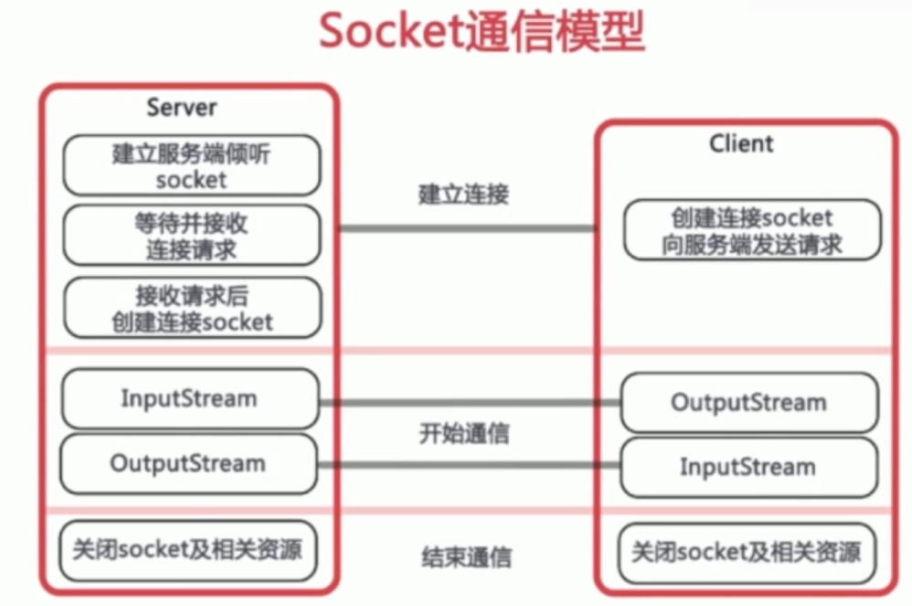

# Socket.io

## Socket.io 是什么

基于事件的实时双向通信库
基于websocket协议
前后端通过事件进行双向通信 （订阅发布模式）
配合express 快速开发实时应用

## Socket.io 和 Ajax 的区别

基于不同的网络协议

Ajax是基于HTTP协议，单向，实时获取数据只能轮询
socket.io 基于 websocket双向通信协议，后端可以主动推送数据

## Socket.io 后端API

配合express

    const Io = reqwuire('socket.io')(http)

Io.on 监听事件

Io.emit 触发事件